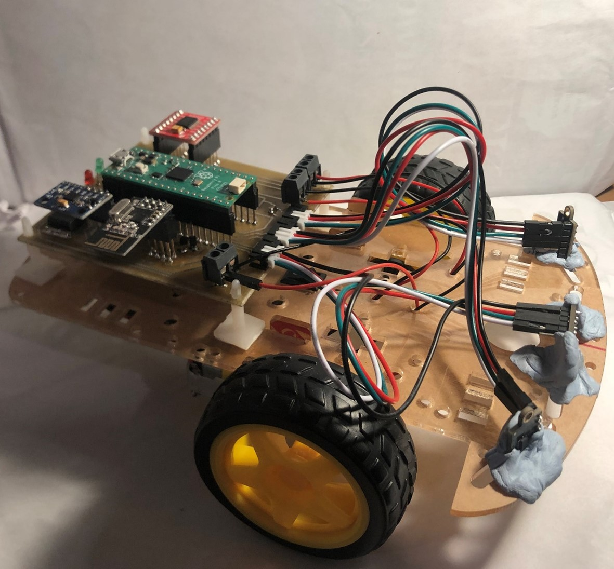

# Low-Cost-Swarm-Robotics-Solution
Final year bachelors project that provides a practical low cost solution for swarm robotics foraging application.

This solution uses multiple agents that implemet a foraging algorithm based of the Swarm Gradient Bug Alogrithm (SGBA) proposed by TU Delft in their own implementation of a [drone swarm](https://www.science.org/doi/10.1126/scirobotics.aaw9710).

The final project used the minimum requirements of a swarm by implementing only 3 robots. A quasi-decentralised method is implemented where one of the agents acts as a central agent that stores and updates the states of the rest of the swarm.

More agents can be added to the swarm by [changing the receiving pipe in the main files (research if mulitple transceivers on main pipe have an effect)].

The robot agents themselves use Raspberry Pi Picos, RP2040 based microcontrollers, due to their low cost (currently under £5 with headers soldered on the Pi Hut website) and flexibility as they can be programmed in either C/C++ or MicroPython.

A custom PCB was created to integrate the components used (.brd file).

There are a few of drawbacks to the system due to the low cost: mainly the step retracing implementation that uses millisecond timing without fusing encoder values, and the object detection method that uses an RGB sensor rather than a camera. If the central agent can no longer communicate to the swarm due to a power failure, the rest of the agents in the swarm are not able to communicate with each other. However a solution is proposed in the final report to circumvent this.

Further improvements to the hardware and software implementation can be found in the final report for the project that can be viewed here (link).
